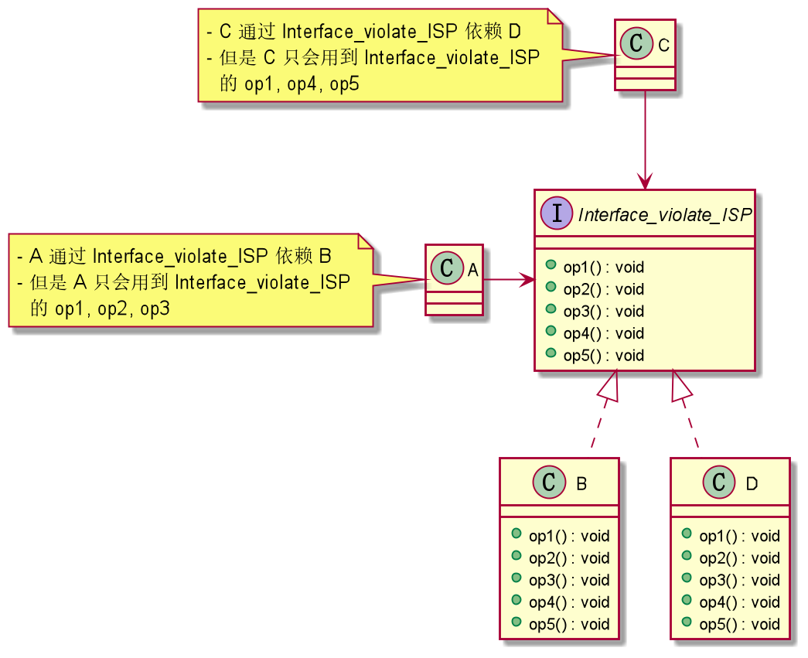

#### ISP
1. 基本介绍
   - 客户端不应该依赖它不需要的接口，即一个类的依赖应该建立在最小接口上

2. 实例
   1. **违反 ISP**
     
     由上类图设计，类`A`通过接口`Interface_violate_ISP`依赖类`B`，类`C`通过接口`Interface_violate_ISP`依赖类`D`，
     如果接口`Interface_violate_ISP`对于类`A`和类`C`来说不是最小接口，
     那么类`B`和类`D`必须去实现它们不需要的方法
     
   2. **改进：遵循`ISP`设计**
      
      将`Interface_violate_ISP`拆分成 `InterfaceBD`
      ，`InterfaceB`，`InterfaceD`，类`A`和类`C`分别
      与它们需要的接口建立依赖关系
     