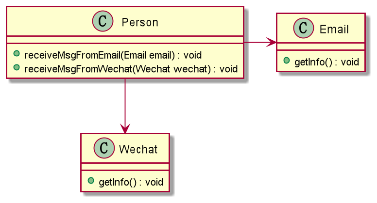

1. 分析
    - 优
        - 简单，容易想到
    - 缺
        - 如果需要从微信、短信等媒介获取消息，则需要新增类，
          同时类`Person`也需要新增相应的接收方法

2. 解决 (采用DIP)
    - 方案：
      引入一个抽象的接口`IReceiver`，表示消息媒介，
      使类`Person`与接口`IReceiver`产生依赖
    - Email，微信，短信都属于消息媒介，他们各系实现接口
      `IReceiver`