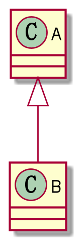
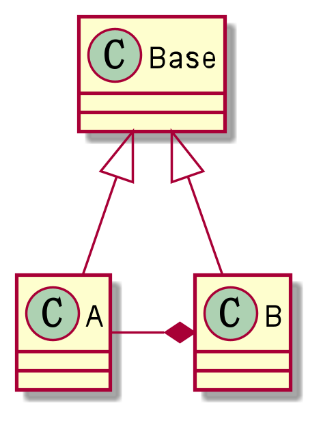

0. OO中的继承性的思考和说明
    - 继承包含这样一种含义：父类中凡是已经实现好的方法，实际上是在设定规范和契约，
      虽然继承关系不强制要求所有子类遵循这些规范或契约，但如果子类对折线已经实现的
      方法任意修改，就会对整个继承体系造成破坏
    - 继承的弊端：给程序带来侵入性，降低程序的可移植性，增加对象间的耦合性。
      若一个类被其他的类所继承，当这个类修改时，必须考虑到所有子类，因为父类的修改
      可能会带来子类的故障
      

1. 如何正确地使用继承——遵循LSP
   - 在使用继承时，遵循LSP，在子类中尽量不要重写父类的方法
   - 采用依赖，聚合，组合等关系代替继承，避免重写父类的方法

2. 采用组合关系

 - 
    